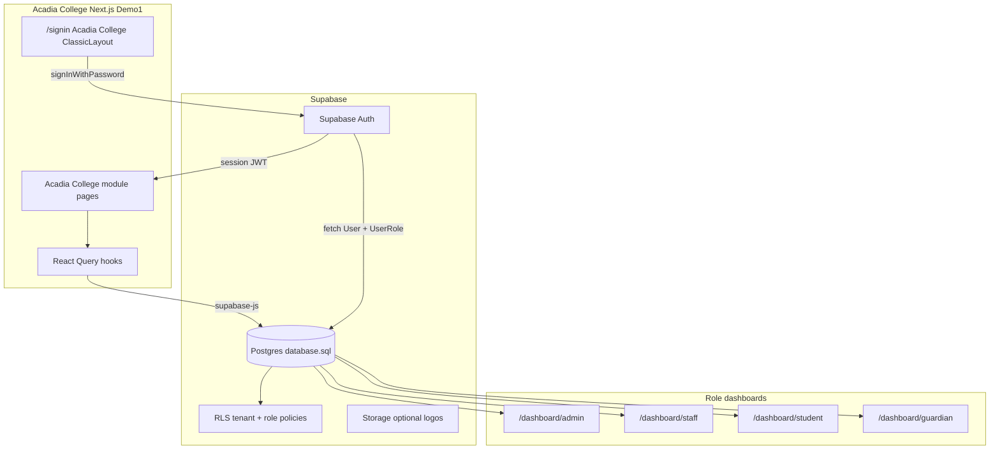

# Product Requirements Document (PRD)

## Acadia College — School Management System

| Field | Value |
|-------|-------|
| **Product name** | Acadia College |
| **Document version** | 1.2 |
| **Build tracker** | [implementation-tracker.md](implementation-tracker.md) |
| **Status** | Draft |
| **Last updated** | May 16, 2026 |
| **UI shell** | Metronic 9 — Demo 1 layout |
| **Backend** | Supabase (Postgres, Auth, RLS) |
| **Hosting** | Vercel |
| **Source control / CI** | GitHub (`gh` CLI, PR workflows) |
| **Schema reference** | `database.sql` |

---

## Agent skills and tooling (implementation mandate)

During build and delivery, the engineering agent **must** load and follow these Cursor skills—do not improvise Supabase, Vercel, or GitHub workflows from memory.

### Supabase skills

| Skill | Responsibility |
|-------|----------------|
| **supabase** | Auth, `@supabase/ssr`, migrations, RLS, MCP (`execute_sql`, `get_advisors`), security checklist |
| **supabase-postgres-best-practices** | Schema design, indexes, efficient queries, RLS policy review |

### Vercel skills

| Skill | Responsibility |
|-------|----------------|
| **bootstrap** | `vercel link`, `vercel env pull`, verify env before `npm run dev` or DB setup |
| **env-vars** | Supabase URL/keys in Vercel (preview + production); never commit secrets |
| **nextjs** | App Router, Server Components, data fetching with Supabase |
| **routing-middleware** | `middleware.ts` session refresh and protected-route redirects |
| **deployments-cicd** | Deploy previews/production, GitHub ↔ Vercel integration, CI workflows |
| **vercel-cli** | `vercel deploy`, logs, promote/rollback |
| **verification** | Post-deploy smoke: sign-in → role dashboard → live data |

Acadia College runs on **Vercel**; **Supabase** is the database and auth provider (not Vercel Postgres).

### GitHub workflows

| Practice | Tooling |
|----------|---------|
| Feature branches & pull requests | `gh` CLI; **new-branch-and-pr** skill |
| CI triage | **fix-ci**, **loop-on-ci**, **ci-watcher**; `gh pr checks` |
| PR quality | **make-pr-easy-to-review**, **babysit** |
| Commits | User git protocol; commits only when requested |

**Delivery pipeline:** branch → push to GitHub → Vercel preview deployment → CI green → merge to main → production promote.

---

## Build progress tracking (mandatory)

All implementation work **must** be reflected in **[docs/implementation-tracker.md](implementation-tracker.md)** so the team always knows what is built vs not built.

### Rules

1. **Single tracker** — The tracker is the source of truth for feature status. Do not rely on memory or chat history.
2. **Update on every feature** — When starting work: set `in_progress`. When complete: set `done` and fill **Route**, **Template source**, and **Notes/PR**.
3. **Sync with PRD IDs** — Each row uses `F-###` / `P#-##` IDs matching §10 below.
4. **Session bookends** — At the start of a build session, read the tracker; at the end, update statuses and the **Overall progress** line at the top.
5. **Blocked work** — Set `blocked` and document why in **Notes**; do not leave rows stale as `in_progress`.
6. **Template source required** — For UI features, **Template source** must be filled before marking `done` (see §5).

### Status values

`not_started` → `in_progress` → `done` | `blocked` | `na`

### Progress reporting

- Header line: `X / Y features complete (Z%)` — recalculate when any row changes.
- Optional: reference tracker section in PR descriptions (e.g. “Closes F-010, F-011”).
- Phase completion: all rows in a phase `done` or `na` before calling the phase complete.

---

## 1. Executive summary

**Acadia College** is a school management web application for running day-to-day academic and administrative operations: student and staff records, courses, enrollment, attendance, grades, fees, transcripts, and messaging. The product is built on the existing Metronic Next.js template (Demo 1 layout) using **only components already present in the template**, with Supabase as the database and authentication backend.

Users sign in with **email and password only**—there is no role selector on the login screen. After authentication, the system reads their role from the database and routes them to the correct dashboard and navigation for their user type.

---

## 2. Goals and objectives

### 2.1 Primary goals

- Deliver a professional, cohesive admin and portal experience branded as **Acadia College** across all user-facing surfaces.
- Implement a multi-tenant school data model aligned with `database.sql` on Supabase Postgres.
- Provide role-specific dashboards and navigation for administrators, staff, students, and guardians.
- **Search the template codebase first** for every screen; reuse the closest existing page and components, changing **data and copy only**—never invent new page layouts when a template equivalent exists.
- Reuse Metronic Demo 1 patterns (cards, DataGrid, account/settings layouts) to accelerate delivery without custom design systems.

### 2.2 Success metrics (initial release)

- Authenticated users reach the correct role dashboard without manual navigation.
- Core list pages (students, staff, courses) load live data from Supabase.
- No user-facing “Metronic” or generic placeholder branding remains.
- Row Level Security enforces tenant isolation for all exposed tables.
- [implementation-tracker.md](implementation-tracker.md) accurately reflects built vs pending features at all times.

---

## 3. Target users and personas

| Persona | Role slug(s) | Primary needs |
|---------|--------------|---------------|
| **Administrator** | `admin` | Full tenant oversight, users, settings, reports |
| **Registrar** | `registrar` | Enrollment, academic structure, student records |
| **Staff / Teacher** | `staff`, `teacher` | Courses, attendance, marks, timetable |
| **Student** | `student` | Own enrollment, schedule, grades, fees, messages |
| **Guardian** | `guardian` | Linked students’ attendance, marks, fees |

---

## 4. Scope

### 4.1 In scope

- Demo 1 layout shell (fixed sidebar + header) for all authenticated routes.
- Classic sign-in page (centered card, background image).
- Supabase Auth (email/password), session management via `@supabase/ssr`.
- Schema migration from `database.sql` to Supabase.
- RLS policies (tenant-scoped; role-refined over phases).
- Role-based dashboards and sidebar filtering.
- Module UIs for registry, academics, curriculum, enrollment, attendance, finance, records, messaging, and administration (phased)—each built by **adapting an existing template page**, not greenfield UI.
- Account/settings pages repurposed for institution profile, user profile, notifications, roles, and fees (same routes, same component tree, new data).
- Bilingual-ready display (EN primary, FR secondary where schema provides `nameEn` / `nameFr`).

### 4.2 Out of scope (initial phases)

- Custom icon libraries beyond template (Lucide, Remix alerts, brand OAuth icons).
- Layout demos other than Demo 1.
- User-type selection on the login page.
- Prisma/NextAuth for new Acadia College features (legacy template paths deprecated in final phase).
- Native mobile apps.
- **Greenfield page designs** that duplicate layout/structure already present elsewhere in the Metronic template.

---

## 5. Template-first page development (mandatory)

This is a **non-negotiable** implementation rule for all Acadia College screens.

### 5.1 Principle

Before designing or building any page, the agent **must search this repository’s template codebase** for an existing page or component that already solves the same UI pattern. If one exists, **use that page and its components as-is**—only replace labels, copy, icons (template Lucide set), and data bindings to reflect Acadia College / `database.sql` fields.

**Do not** create new layouts, new card compositions, or new component abstractions when the template already provides them.

### 5.2 Required workflow (per screen)

1. **Search** — Grep/glob the repo for the closest match (e.g. list page → `user-management/users`, table → `account/members/teams`, profile → `account/home/user-profile`, settings → `account/home/settings-sidebar`, sign-in → `app/(auth)/signin`).
2. **Identify** — Record the template source path(s): `page.tsx`, `content.tsx`, `components/*`, layout wrappers (`PageNavbar`, `Toolbar`, `Container`).
3. **Map** — Document which template file becomes which Acadia College route and which SQL/Supabase fields replace mock columns.
4. **Adapt** — Copy or edit in place: keep file structure, imports, grid classes, and component hierarchy **unchanged** unless a field truly cannot map.
5. **Wire data** — Swap mock/API/Prisma sources for Supabase queries; keep the same UI components (`Card`, `DataGrid`, form fields, badges).
6. **Verify** — Side-by-side check: Acadia College page should look like the template page with different text and rows.

### 5.3 What may change vs what must not

| Allowed changes | Not allowed (without explicit approval) |
|-----------------|----------------------------------------|
| Page title, toolbar text, breadcrumbs | New page layout or grid structure |
| Table columns, row data, badges, filters | New custom components replacing template cards/tables |
| Form field labels and values | Different icon library or icon set |
| Navigation paths and menu labels | Skipping `page.tsx` + `content.tsx` + `components/` pattern |
| Branding strings (“Acadia College”) | Importing missing `@/partials/*` instead of finding an in-repo equivalent |
| Data layer (Supabase instead of mocks) | Building a “similar” UI from scratch |

### 5.4 Reference mapping (starting points)

| Acadia College screen | Search / reuse from template |
|----------------------|------------------------------|
| Sign-in | `app/(auth)/signin` + `layouts/classic.tsx` |
| User list / admin users | `user-management/users` |
| Roles & permissions | `account/members/roles`, `permissions-check` |
| Data table lists (courses, teams-like) | `account/members/teams` |
| Student/staff profile | `account/home/user-profile` (+ components folder) |
| Institution settings | `account/home/company-profile`, `settings-sidebar` |
| Notifications | `account/notifications` |
| Billing / fees UI | `account/billing/basic` |
| Get started hub | `account/home/get-started` |
| Dashboard widgets | Closest demo dashboard cards/charts in template; same `Card` / `chart` usage |

Extend this table as new modules are scoped—**always search first**, then add a row.

### 5.5 Acceptance criteria (template compliance)

- [ ] Every new route documents its **template source path** in the PR or commit description.
- [ ] No Acadia College page introduces a layout pattern absent from the template without written justification.
- [ ] Component imports come from `components/ui/*`, `components/common/*`, and existing `app/(protected)/**/components/*`—not net-new design systems.

---

## 6. Branding requirements

**Acadia College** must appear on every user-visible surface. Replace Metronic and generic “school app” labels.

| Surface | Requirement |
|---------|-------------|
| App metadata | `title`: “Acadia College”; description references Acadia College school management |
| Sign-in | Heading: “Sign in to Acadia College” |
| Sidebar header | “Acadia College” or tenant `displayNameEn` |
| Footer | “© {year} Acadia College” |
| Page toolbars | e.g. “Acadia College — Students”, “Acadia College — Dashboard” |
| Role dashboards | “Welcome to Acadia College” + role-specific subtitle |
| Browser tab | `%s \| Acadia College` |
| Seed tenant | `displayNameEn`: “Acadia College”; `displayNameFr`: “Collège Acadia” |
| Email | `SMTP_SENDER=Acadia College` |

Do not rebrand third-party template credits in code comments—only user-visible strings.

---

## 7. Authentication and authorization

### 7.1 Sign-in experience

- **Layout:** Classic (`app/(auth)/layouts/classic.tsx`)—centered card on full-page background.
- **Fields:** Email, password, remember me, forgot password link.
- **Explicitly excluded:** User-type selector, role tabs, “I am a student/staff” UI.
- **API:** `supabase.auth.signInWithPassword({ email, password })`.
- **Post-login:** Query `User` + `UserRole.slug` → redirect via `getDashboardPathForRole(roleSlug)`.

### 7.2 Role-based routing

| Role slug | Dashboard route | Focus |
|-----------|-----------------|-------|
| `admin`, `registrar` | `/dashboard/admin` | Tenant KPIs, enrollments, applications, fees, system log |
| `staff`, `teacher` | `/dashboard/staff` | My courses, timetable, attendance sessions, grading |
| `student` | `/dashboard/student` | Enrollment, timetable, attendance, marks, fees, messages |
| `guardian` | `/dashboard/guardian` | Linked students, child attendance/marks/fees |

- `/` acts as a redirect hub to the user’s role dashboard.
- `middleware.ts` refreshes Supabase session; unauthenticated users go to `/signin`.
- Sidebar menu filtered by role (`getMenuForRole(roleSlug)`).

### 7.3 Security rules

- Do **not** use `user_metadata` for authorization decisions.
- Primary role source: `public.User` + `UserRole`.
- Never expose `SUPABASE_SERVICE_ROLE_KEY` in client bundles.
- Enable RLS on all `public` tables exposed to the Data API.

---

## 8. Technical architecture

### 8.1 Stack

| Layer | Technology |
|-------|------------|
| Frontend | Next.js 15+, React 19, Metronic Demo 1, Tailwind, shadcn/ReUI components |
| Data fetching | React Query + Supabase JS client |
| Backend | Supabase Postgres |
| Auth | Supabase Auth + `@supabase/ssr` |
| Schema source | `database.sql` (~45 tables, multi-tenant) |

### 8.2 Architecture diagram



### 8.3 Data model

- **Source of truth:** `database.sql` applied as Supabase migrations under `supabase/migrations/`.
- **Auth link:** `User.id = auth.users.id` (UUID); `roleId`, `tenantId`, `status` on `User`.
- **Multi-tenancy:** All school tables include `tenantId`; RLS filters by signed-in user’s tenant.
- **Credentials:** Stored in Supabase Auth, not `User.password`.

### 8.4 Data access pattern

```
lib/supabase/
  client.ts              # browser client
  server.ts              # server component client
  middleware.ts          # session refresh
  queries/               # domain query helpers
hooks/
  use-acadia-college-session.ts
  use-students.ts        # React Query + supabase
lib/auth/
  dashboard-routes.ts    # roleSlug → path
```

### 8.5 Environment variables

```
NEXT_PUBLIC_SUPABASE_URL=
NEXT_PUBLIC_SUPABASE_PUBLISHABLE_KEY=
SUPABASE_SERVICE_ROLE_KEY=          # server-only
DATABASE_URL=                        # migrations (existing Supabase pooler)
DIRECT_URL=
```

---

## 9. Navigation structure

Sidebar (`config/menu.config.tsx`) uses **Lucide icons only** (template convention). Metronic demo links (public-profile, store-client, dark-sidebar) are removed or hidden.

| Section | Routes | Primary entities |
|---------|--------|------------------|
| Dashboard | Role-specific home | Aggregates by role |
| Students | `/students`, `/students/[id]` | `StudentProfile`, `StudentEnrollment` |
| Staff | `/staff`, `/staff/[id]` | `StaffProfile`, `Department` |
| Academics | `/academics/*` | `AcademicYear`, `Semester`, `Department`, `Level`, `Specialty`, `Room`, `AcademicCalendarMilestone` |
| Curriculum | `/courses`, `/courses/[id]`, `/timetable` | `Course`, `CourseAssignment`, `TimetableSlot` |
| Enrollment | `/enrollment/applications`, `/enrollment/enrollments` | `EnrollmentApplication`, `StudentEnrollment` |
| Attendance & grades | `/attendance`, `/marks`, `/coursework`, `/exams` | `AttendanceSession`, `AttendanceRecord`, `CourseMark`, `CourseworkTask`, `ExamSession` |
| Finance | `/finance/fees`, `/finance/scholarships` | `StudentFeeAccount`, `StudentFeeInstallment`, `ScholarshipType` |
| Records | `/transcripts`, `/transcripts/requests` | `Transcript`, `TranscriptCopyRequest` |
| Messages | `/messages` | `MessageThread`, `Message` |
| Administration | `/admin/users`, `/admin/roles`, `/admin/logs` | `User`, `UserRole`, `SystemLog` |
| My account | Existing `/account/*` paths (content only) | `User`, `NotificationPreference`, `Tenant`, `SystemSetting` |

---

## 10. Functional requirements by module

**Status column:** Live values maintained in [implementation-tracker.md](implementation-tracker.md). Summary below defaults to `not_started` until implementation begins.

### 10.1 Foundation

| ID | Requirement | Priority | Tracker status |
|----|-------------|----------|----------------|
| F-001 | Apply `database.sql` to Supabase via migrations | P0 | `not_started` |
| F-002 | Seed Acadia College tenant, roles, and test users | P0 | `not_started` |
| F-003 | Classic sign-in with Acadia College branding | P0 | `not_started` |
| F-004 | Role-based post-login redirect (no role picker) | P0 | `not_started` |
| F-005 | Four role dashboards with live Supabase KPIs | P0 | `not_started` |
| F-006 | Role-filtered sidebar navigation | P0 | `not_started` |
| F-007 | Acadia College branding pass (metadata, header, footer, toolbars) | P0 | `not_started` |

### 10.2 Core registry

| ID | Requirement | Priority | Tracker status |
|----|-------------|----------|----------------|
| F-010 | Students list (search, filter, pagination) | P1 | `not_started` |
| F-011 | Student detail profile | P1 | `not_started` |
| F-012 | Staff list and detail | P1 | `not_started` |
| F-013 | Academic structure CRUD (years, semesters, departments, levels, specialties, rooms) | P1 | `not_started` |
| F-014 | Courses list and detail | P1 | `not_started` |
| F-015 | Academic calendar milestones view | P2 | `not_started` |

### 10.3 Operations

| ID | Requirement | Priority | Tracker status |
|----|-------------|----------|----------------|
| F-020 | Enrollment applications list | P2 | `not_started` |
| F-021 | Student enrollments list | P2 | `not_started` |
| F-022 | Attendance sessions and records | P2 | `not_started` |
| F-023 | Course marks entry/view | P2 | `not_started` |
| F-024 | Timetable view | P2 | `not_started` |
| F-025 | Coursework tasks and submissions | P3 | `not_started` |
| F-026 | Exam sessions | P3 | `not_started` |

### 10.4 Finance and records

| ID | Requirement | Priority | Tracker status |
|----|-------------|----------|----------------|
| F-030 | Student fee accounts and installments | P2 | `not_started` |
| F-031 | Scholarships | P3 | `not_started` |
| F-032 | Transcripts and copy requests | P3 | `not_started` |
| F-033 | Messaging (threads) | P2 | `not_started` |

### 10.5 Administration and account

| ID | Requirement | Priority | Tracker status |
|----|-------------|----------|----------------|
| F-040 | Users and roles management | P1 | `not_started` |
| F-041 | Institution profile (`Tenant`) | P1 | `not_started` |
| F-042 | System settings and preferences | P1 | `not_started` |
| F-043 | User profile and notifications | P1 | `not_started` |
| F-044 | API keys (`TenantApiKey`) | P3 | `not_started` |
| F-045 | System log view | P2 | `not_started` |

---

## 11. UI implementation standards

### 11.1 Template reuse patterns (strict)

| Pattern | Use for | Template reference |
|---------|---------|-------------------|
| **A — List / CRUD** | Students, staff, courses, enrollments, fees | `user-management/users` DataGrid |
| **B — Detail / profile** | Student/staff detail | `account/home/user-profile` card grid |
| **C — Settings** | Institution, preferences, notifications | Existing `/account/*` routes, content only |
| **D — Dashboards** | Role home pages | `Card`, `chart`, summary tables |
| **E — Sign-in** | Authentication | Classic layout + existing form components |

**Rule:** Patterns A–E are applied only **after** completing §5 Template-first workflow (search → identify → map → adapt). The template page is the implementation—not a loose inspiration.

### 11.2 UX rules

- Demo 1 layout only; no layout swaps.
- Use existing `Card`, `CardHeader`, `CardTable`, `CardFooter` components.
- Status badges aligned to SQL enums (`EnrollmentApplication`, `AttendanceRecordStatus`, `FeeInstallmentStatus`, etc.).
- Do not import missing `@/partials/*` paths; use `components/common/toolbar` and `components/ui/*` only.
- Icons: Lucide (menu/UI), Remix (form alerts), `components/common/icons` (OAuth brands only).

### 11.3 Account page mapping

| Acadia College need | Route | Data |
|--------------------|-------|------|
| Institution profile | `/account/home/company-profile` | `Tenant` |
| System preferences | `/account/home/settings-sidebar` | `SystemSetting`, tenant policies |
| User profile | `/account/home/user-profile` | `User`, role |
| Notifications | `/account/notifications` | `NotificationPreference` |
| Roles & permissions | `/account/members/roles` | `UserRole`, `UserPermission` |
| Fees | `/account/billing/basic` | `StudentFeeAccount`, installments |
| Get started | `/account/home/get-started` | Acadia College admin quick links |
| API keys | `/account/api-keys` | `TenantApiKey` |

---

## 12. File structure (target)

```
docs/
  prd.md
app/(protected)/
  page.tsx                    # Redirect hub → role dashboard
  dashboard/
    admin/ staff/ student/ guardian/
  students/ staff/ academics/ courses/
  enrollment/ attendance/ finance/
  transcripts/ messages/ admin/
app/(auth)/
  layout.tsx                  # ClassicLayout
  signin/page.tsx
lib/supabase/
lib/auth/dashboard-routes.ts
hooks/use-acadia-college-session.ts
middleware.ts
supabase/migrations/
supabase/seed.sql
config/menu.config.tsx
```

---

## 13. Phased delivery roadmap

| Phase | Name | Deliverables |
|-------|------|--------------|
| **0** | Supabase foundation | **Skills:** supabase, supabase-postgres-best-practices. Migrations, RLS, seed, `@supabase/ssr`, env config |
| **0b** | Vercel + GitHub setup | **Skills:** bootstrap, env-vars. `vercel link`, env pull, GitHub repo connected, preview deploys |
| **1** | Foundation | **Skills:** nextjs, routing-middleware. Branding, sign-in, role redirect, dashboards, sidebar, account pages |
| **2** | Core registry | Students, staff, academic structure, courses |
| **3** | Operations | Enrollment, attendance, marks, timetable |
| **4** | Finance & records | Fees, scholarships, transcripts, messages |
| **5** | Cleanup | Deprecate NextAuth/Prisma; Supabase Storage for logos |
| **—** | Cross-cutting | **Skills:** deployments-cicd, vercel-cli, verification; GitHub PR/CI skills per merge |

---

## 14. Acceptance criteria

### 14.1 Template reuse

- [ ] Each Acadia College route lists its **template source path** before merge.
- [ ] Pages preserve template `page.tsx` / `content.tsx` / `components/` structure.
- [ ] Visual parity with template equivalent (layout unchanged; data/copy only).

### 14.2 Authentication

- [ ] `/signin` uses Classic layout with “Sign in to Acadia College”.
- [ ] Form has email and password only (no role selector).
- [ ] Successful login redirects to the correct `/dashboard/{role}`.
- [ ] `/` redirects authenticated users to their role dashboard.

### 14.3 Branding

- [ ] No user-facing “Metronic” strings.
- [ ] Sidebar, footer, and browser tab show Acadia College.

### 14.4 Data and security

- [ ] Supabase schema matches `database.sql`.
- [ ] RLS enabled on exposed tables; advisors show no critical issues.
- [ ] Dashboard and list pages use live Supabase data.
- [ ] `service_role` key not in client bundle.

### 14.5 Navigation

- [ ] Sidebar items match user role.
- [ ] All phase-delivered routes resolve without 404.

---

## 15. Risks and mitigations

| Risk | Impact | Mitigation |
|------|--------|------------|
| NextAuth vs Supabase Auth conflict | Broken sessions | Migrate Acadia College routes to Supabase Auth; remove NextAuth from protected layout |
| `database.sql` complexity (enums, composite FKs) | Migration failures | Ordered migrations; test on Supabase branch/local first |
| RLS blocks development reads | Empty UI | Start with tenant-scoped SELECT; tighten writes incrementally |
| Missing `@/partials/*` in template checkout | Build errors | Use `components/common` + `components/ui` only |
| Empty demo1 dashboard import | Home route crash | Replace in Phase 1 |
| Large schema scope | Schedule slip | Phased delivery; template-adapted pages |
| Custom UI built from scratch | Inconsistent UX, wasted effort | Mandatory template search (§5) before any page work |

---

## 16. Dependencies and constraints

- Metronic 9 Next.js template (Demo 1 layout) — UI components must come from the existing template.
- Supabase project with Postgres; connection URLs in `.env.example`.
- `database.sql` as canonical schema definition.
- Existing React Query and DataGrid patterns from user-management module.
- **Vercel** project linked to the GitHub repo; environment variables synced via `vercel env pull` / Vercel dashboard.
- **Agent skills** (Supabase, Vercel, GitHub workflows) required for all implementation phases—see § Agent skills and tooling.
- **Template-first rule** (§5): search codebase and reuse existing pages/components before any new UI design.

---

## 17. Open questions

| # | Question | Owner |
|---|----------|-------|
| 1 | Confirm French display name: “Collège Acadia” vs alternative | Product |
| 2 | Keep Google OAuth on sign-in in Phase 1? | Product |
| 3 | Retain Metronic demo routes as dev-only references? | Product |

---

## 18. Implementation checklist (engineering)

- [ ] `acadia-branding` — branding pass
- [ ] `supabase-foundation` — migrations, RLS, seed, clients
- [ ] `foundation-auth-dashboard` — sign-in, dashboards, Supabase queries
- [ ] `role-based-routing` — session hook, middleware, menu filter
- [ ] `school-navigation` — Acadia College `MENU_SIDEBAR`
- [ ] `core-lists` — students, staff, courses, academics
- [ ] `repurpose-account` — account pages on Supabase
- [ ] `operations-modules` — enrollment through messages
- [ ] `deprecate-prisma-nextauth` — remove legacy auth/data paths
- [ ] `vercel-github-delivery` — Vercel link, env sync, preview/prod deploy, GitHub PR/CI
- [ ] Per route: template source path identified via codebase search before implementation
- [ ] [implementation-tracker.md](implementation-tracker.md) updated for every feature started/completed
- [ ] Overall progress % in tracker header recalculated after changes

---

## 19. Deployment and environment matrix

| Environment | Host | Database / Auth | Config source |
|-------------|------|-----------------|---------------|
| Local | `npm run dev` | Supabase (dev project or local stack) | `.env.local` from `vercel env pull` |
| Preview | Vercel preview URL | Supabase (staging branch/project) | Vercel preview env vars |
| Production | Vercel production | Supabase production | Vercel production env vars |

Required Vercel env vars (minimum): `NEXT_PUBLIC_SUPABASE_URL`, `NEXT_PUBLIC_SUPABASE_PUBLISHABLE_KEY`, `SUPABASE_SERVICE_ROLE_KEY` (server only).

---

*This PRD is derived from the Acadia College implementation plan. Update this document when scope or requirements change.*
